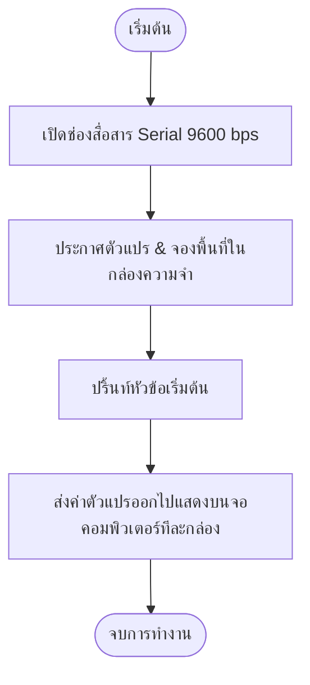

# Exercise 01: ทำความรู้จักกับชนิดตัวแปร (Data Types)

แบบฝึกหัดนี้จะพาทุกคนไปเรียนรู้เรื่อง **"ตัวแปร" (Variables)** ซึ่งเปรียบเสมือนพื้นฐานแรกสุดของการเขียนโปรแกรมบนบอร์ด Arduino

---

## 💡 แนวคิดเข้าใจง่าย (Analogy)

ให้จินตนาการว่า **"ตัวแปร"** คือ **"กล่องเก็บของในโกดังสินค้า"**
เมื่อเรามีข้อมูลหลายรูปแบบ (เช่น ชื่อ, อายุ, น้ำหนัก) เราจึงต้องการกล่องที่มีลักษณะและขนาดต่างกันเพื่อเก็บของแต่ละอย่างให้เหมาะสมที่สุดและประหยัดพื้นที่:

1. **กล่องสำหรับตัวเลขจำนวนเต็ม (Integer & Byte)**
   * **`byte`** : กล่องขนาดเล็กจิ๋ว (จุเลขได้แค่ 0 ถึง 255) เหมาะสำหรับระบุขาพินบอร์ด (เช่น ขา 13)
   * **`int`** : กล่องขนาดมาตรฐาน (จุตัวเลขทั่วไป เช่น อายุ)
   * **`long`** : ลังขนาดใหญ่พิเศษ (จุตัวเลขหลักแสนหลักล้าน เช่น วินาทีทำงานของระบบ)

2. **กล่องสำหรับตัวเลขทศนิยม (Floating Point)**
   * **`float`** : กล่องวัดค่าละเอียดมีจุดทศนิยม (เช่น น้ำหนัก 65.5, อุณหภูมิ)
   * **`double`** : กล่องละเอียดพิเศษสำหรับทศนิยมหลายตำแหน่ง (ในบอร์ดเล็กจะเหมือน float)

3. **กล่องสำหรับตัวอักษรและข้อความ (Character & String)**
   * **`char`** : ช่องใส่การ์ดตัวอักษร **ตัวเดียวโดดๆ** เช่น 'A' หรือ 'B' (ต้องใช้เครื่องหมายโควตเดี่ยว `' '`)
   * **`String`** : กล่องเก็บสายข้อความยาวๆ เช่น "Arduino" (ต้องใช้เครื่องหมายโควตคู่ `" "`)

4. **สวิตช์สถานะตรรกะ (Boolean)**
   * **`bool`** : สวิตช์ไฟที่มีแค่ 2 สถานะคือ เปิด (`true` / เลข 1) หรือ ปิด (`false` / เลข 0)

---

## 📊 ผังการทำงาน (Flowchart)

---

## 🔌 การเชื่อมต่อฮาร์ดแวร์ (Hardware Setup)

แบบฝึกหัดนี้เป็นโปรแกรมคำนวณและประมวลผลภายในบอร์ด (Console Program) **ไม่ต้องเชื่อมต่ออุปกรณ์เซ็นเซอร์ใดๆ เพิ่มเติม**
* เพียงแค่เชื่อมต่อบอร์ด Arduino UNO เข้ากับเครื่องคอมพิวเตอร์ผ่านสาย USB เพื่อทำการอัปโหลดโค้ดและส่งข้อมูลกลับมาแสดงผล

---

## 🔍 อธิบายโค้ดที่สำคัญ

* **`Serial.begin(9600);`**
  เป็นการตั้งค่าเปิดช่องทางการส่งข้อมูลระหว่างบอร์ด Arduino กับคอมพิวเตอร์ ที่ความเร็ว 9600 bps (Bits per second)
* **`Serial.print("ข้อความ");`**
  ส่งข้อความไปแสดงบนหน้าจอคอมพิวเตอร์ โดยให้เคอร์เซอร์ค้างไว้ที่เดิมหลังส่งเสร็จ
* **`Serial.println(ตัวแปร);`**
  ส่งค่าตัวแปรไปแสดงบนหน้าจอคอมพิวเตอร์ และปัดบรรทัดใหม่ทันที (ln ย่อมาจาก line)

---

## 🚀 วิธีการทดสอบ

1. เปิดไฟล์ [exercise01.ino](file:///g:/My%20Drive/0.Working.2026/SSC20.%E0%B8%AA%E0%B8%AD%E0%B8%99%E0%B8%87%E0%B8%B2%E0%B8%99%E0%B8%9E%E0%B8%B1%E0%B8%92%E0%B8%99%E0%B8%B2Android/Lab_Embedded_System/Day1_C_Arduino_Lab/exercise01/exercise01.ino) ด้วยโปรแกรม **Arduino IDE**
2. เสียบบอร์ด Arduino เข้ากับคอมพิวเตอร์ และเลือกบอร์ด (Board) กับพอร์ต (Port) ให้ถูกต้อง
3. กดปุ่ม **Upload** (ลูกศรขวา ➔) เพื่ออัปโหลดโค้ดลงบอร์ด
4. คลิกไอคอน **Serial Monitor** (รูปแว่นขยายที่มุมขวาบนของโปรแกรม)
5. ปรับตั้งค่าความเร็วที่มุมขวาล่างของ Serial Monitor ให้เป็น **9600 baud**
6. สังเกตค่าตัวแปรประเภทต่างๆ ที่ถูกส่งออกมาแสดงผลบนหน้าจอคอมพิวเตอร์ของคุณ!
