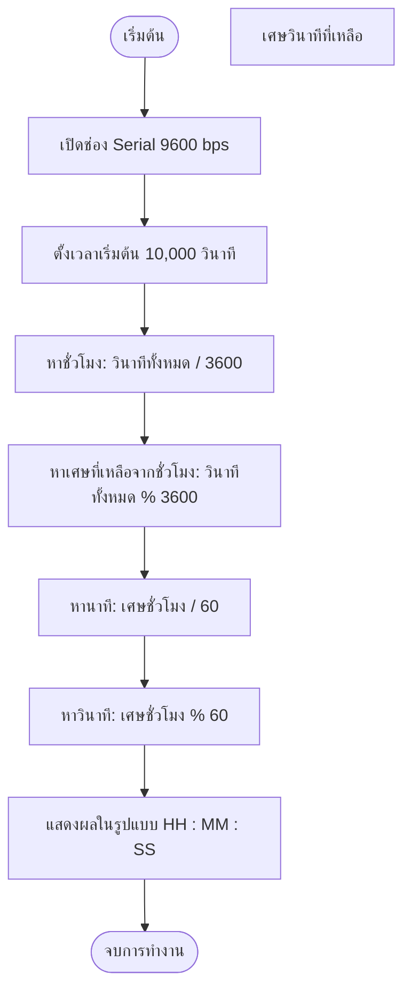

# Exercise 02: ระบบคำนวณแบ่งเศษเวลา (Division & Modulo `%`)

ในแบบฝึกหัดนี้ ผู้เรียนจะได้ฝึกฝนการใช้ตัวดำเนินการคำนวณคณิตศาสตร์ โดยเฉพาะการหารปกติ (`/`) และการหารเอาเศษ (`%` หรือ Modulo) ซึ่งเป็นส่วนสำคัญในการจัดระเบียบเวลาทำงานของระบบ (Uptime)

---

## 💡 แนวคิดเข้าใจง่าย (Analogy)

ให้จินตนาการว่าคุณมี **เหรียญ 1 บาท จำนวน 10,000 เหรียญ** ใส่ไว้ในถุงใหญ่ (เทียบเท่า 10,000 วินาที)
และคุณต้องการแลกเป็นธนบัตรชนิดต่างๆ เพื่อให้พกพาง่ายขึ้น:

1. **แลกเป็นแบงก์ร้อย (เทียบเป็น "ชั่วโมง" : 1 ชั่วโมง = 3600 วินาที)**
   * การหารเอาส่วน (`/`) : `10000 / 3600` จะได้ **2** (แลกแบงก์ร้อยได้ 2 ใบใหญ่)
   * การหารเอาเศษ (`%`) : `10000 % 3600` จะได้เศษ **2800** (เหลือเหรียญในถุงที่แลกไม่ได้อีก 2,800 บาท)

2. **นำเศษที่เหลือมาแลกแบงก์ย่อย (เทียบเป็น "นาที" : 1 นาที = 60 วินาที)**
   * นำเศษ 2800 บาทมาแลกต่อ : `2800 / 60` จะได้ **46** (ได้แบงก์ย่อย 46 ใบ)
   * เศษสุดท้ายที่เหลือคาถุงอยู่อีก : `2800 % 60` จะเหลือเศษ **40** (ซึ่งก็คือวินาทีสุดท้ายนั่นเอง)

ทำให้จาก 10,000 วินาที เราจัดระเบียบได้เป็น: **2 ชั่วโมง : 46 นาที : 40 วินาที**

---

## 📊 ผังการทำงาน (Flowchart)

---

## 🔌 การเชื่อมต่อฮาร์ดแวร์ (Hardware Setup)

แบบฝึกหัดนี้เป็นการประมวลผลทางคณิตศาสตร์ภายในบอร์ด **ไม่ต้องเชื่อมต่ออุปกรณ์เซ็นเซอร์ใดๆ**
* เชื่อมต่อบอร์ด Arduino เข้ากับเครื่องคอมพิวเตอร์ผ่านสาย USB เพื่อทำการอัปโหลดโค้ดและทดสอบระบบผ่าน Serial Monitor

---

## 🔍 อธิบายโค้ดที่สำคัญ

* **`unsigned long`**
  ตัวแปรจำนวนเต็มแบบไม่มีเครื่องหมายติดลบ ทำให้เก็บค่าบวกได้มากเป็นสองเท่าของแบบปกติ (นิยมใช้กับตัวแปรที่ใช้นับเวลา เพราะเวลาไม่มีค่าติดลบ)
* **`/` (ตัวดำเนินการหาร)**
  ในภาษา C/C++ เมื่อจำนวนเต็มหารด้วยจำนวนเต็ม ผลลัพธ์ที่ได้จะเป็นจำนวนเต็มเสมอ โดยตัดเศษทศนิยมทิ้งทันที (เช่น `10000 / 3600` ได้ `2` ไม่ใช่ `2.777`)
* **`%` (ตัวดำเนินการ Modulo)**
  หาเฉพาะเศษที่เหลือจากการหาร (เช่น `10 % 3` ได้เศษ `1`)

---

## 🚀 วิธีการทดสอบ

1. เปิดไฟล์ [exercise02.ino](file:///g:/My%20Drive/0.Working.2026/SSC20.%E0%B8%AA%E0%B8%AD%E0%B8%99%E0%B8%87%E0%B8%B2%E0%B8%99%E0%B8%9E%E0%B8%B1%E0%B8%92%E0%B8%99%E0%B8%B2Android/Lab_Embedded_System/Day1_C_Arduino_Lab/exercise02/exercise02.ino) ด้วยโปรแกรม **Arduino IDE**
2. กดปุ่ม **Upload** เพื่อส่งโปรแกรมลงบอร์ด
3. เปิดหน้าต่าง **Serial Monitor** และสังเกตผลการแปลงค่า 10,000 วินาที ให้ออกมาเป็นเวลาที่อ่านง่าย
4. ทดลองเปลี่ยนตัวเลข `totalSeconds = 10000;` ในโค้ดบรรทัดที่ 5 เป็นตัวเลขอื่นๆ (เช่น 5000 หรือ 86400) จากนั้นลองอัปโหลดโค้ดใหม่เพื่อดูผลลัพธ์การคำนวณที่เปลี่ยนแปลงไป!
