# Exercise 03: ตรวจสอบขนาดความจุหน่วยความจำ (`sizeof()`)

ในแบบฝึกหัดนี้ เราจะพาทุกคนไปส่องดูเบื้องหลังของหน่วยความจำในไมโครคอนโทรลเลอร์ว่า ตัวแปรแต่ละแบบใช้พื้นที่เก็บข้อมูลจริงในแรมกี่ช่อง (Bytes) ด้วยคำสั่ง `sizeof()`

---

## 💡 แนวคิดเข้าใจง่าย (Analogy)

ให้คิดว่า **หน่วยความจำ (RAM)** บนบอร์ด Arduino เหมือนกับ **"ตู้ล็อคเกอร์ฝากของ"**
โดยล็อคเกอร์แต่ละช่องจะมีขนาดมาตรฐานเท่ากับ **1 Byte (ไบต์)**
ตัวแปรแต่ละชนิดก็เหมือนกล่องประเภทต่างกันที่ต้องจองจำนวนช่องล็อคเกอร์ไม่เท่ากัน:

* **`bool` (ตรรกะ) / `char` (อักษรตัวเดียว)** : ใช้พื้นที่ **1 ช่อง (1 Byte)** เพราะเก็บสถานะแค่ เปิด/ปิด หรืออักษรตัวเดียว
* **`int` (ตัวเลขจำนวนเต็มทั่วไป)** : ใช้พื้นที่ **2 ช่อง (2 Bytes)** (บนบอร์ด Uno/Nano) เพื่อรวมช่องให้สามารถจุเลขที่ใหญ่ขึ้นได้ (ตั้งแต่ -32,768 ถึง 32,767)
* **`long` (ตัวเลขจำนวนเต็มขนาดใหญ่)** : จองยาวไปเลย **4 ช่อง (4 Bytes)** สำหรับรองรับตัวเลขสูงหลายล้าน
* **`float` (เลขทศนิยม)** : ต้องจอง **4 ช่อง (4 Bytes)** เนื่องจากต้องใช้แรมหลายช่องในการแบ่งเก็บส่วนจำนวนเต็มและส่วนเศษทศนิยมอย่างละเอียด

> ⚠️ **ทำไมต้องใส่ใจ?** บอร์ด Arduino UNO มีหน่วยความจำ (RAM) น้อยมาก เพียงแค่ **2,048 Bytes** เท่านั้น (ขณะที่คอมพิวเตอร์ทั่วไปมีเป็นล้านๆ Bytes) การเข้าใจและเลือกขนาดตัวแปรที่ใช้พื้นที่พอเหมาะจึงเป็นสิ่งที่วิศวกรทุกคนต้องให้ความสำคัญ

---

## 📊 ผังแสดงขนาดตัวแปรในหน่วยความจำ

```mermaid
gantt
    title เปรียบเทียบพื้นที่ใช้งานบนหน่วยความจำ (Bytes)
    dateFormat  X
    axisFormat %s Byte(s)
    
    section boolean / char
    จอง 1 Byte            :active, 0, 1
    
    section int
    จอง 2 Bytes           :crit, 0, 2
    
    section long / float
    จอง 4 Bytes           :done, 0, 4
```

---

## 🔍 อธิบายโค้ดที่สำคัญ

* **`sizeof(ชื่อตัวแปร หรือ ชนิดข้อมูล);`**
  เป็นตัวดำเนินการพิเศษในภาษา C++ สำหรับคำนวณและแสดงค่าจำนวนไบต์ที่ใช้จริงบนแรมของตัวแปรนั้นๆ
* **ผลลัพธ์บน Serial Monitor**
  จะปริ้นตัวเลขจำนวนหลักไบต์ออกมาโดยตรง (เช่น ปริ้น 2 สำหรับ int, ปริ้น 4 สำหรับ float)

---

## 🚀 วิธีการทดสอบ

1. เปิดไฟล์ [exercise03.ino](file:///g:/My%20Drive/0.Working.2026/SSC20.%E0%B8%AA%E0%B8%AD%E0%B8%99%E0%B8%87%E0%B8%B2%E0%B8%99%E0%B8%9E%E0%B8%B1%E0%B8%92%E0%B8%99%E0%B8%B2Android/Lab_Embedded_System/Day1_C_Arduino_Lab/exercise03/exercise03.ino) ด้วยโปรแกรม **Arduino IDE**
2. อัปโหลดโค้ดลงบอร์ดให้เสร็จสิ้น
3. เปิดหน้าต่าง **Serial Monitor** เพื่อดูผลสรุปการจองขนาดพื้นที่หน่วยความจำของข้อมูลแต่ละประเภท
4. *ข้อสังเกตเพิ่มเติม:* หากคุณย้ายโค้ดชุดนี้ไปคอมไพล์บนบอร์ดที่เป็นแบบ 32-bit (เช่น ESP32 หรือ Arduino Due) ตัวแปร `int` อาจจะแสดงพื้นที่จองเพิ่มเป็น 4 Bytes เนื่องจากฮาร์ดแวร์มีขนาดบัสข้อมูลที่กว้างขึ้น!
