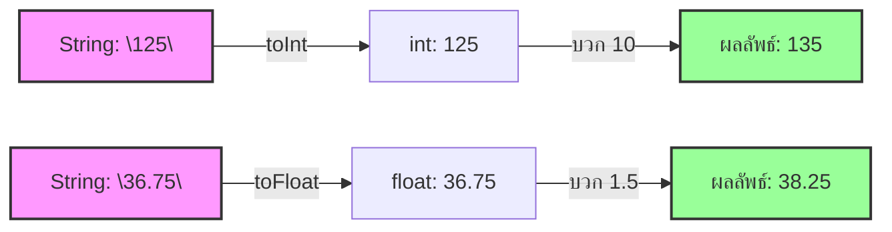

# Exercise 04: การแปลงข้อความเป็นตัวเลข (String to Number)

แบบฝึกหัดนี้จะสอนวิธีจัดการกับข้อมูลข้อความ (String) ที่เรามักได้รับมาจากเครือข่ายอินเทอร์เน็ต เซ็นเซอร์ หรือพิมพ์รับค่าเข้าช่อง Serial แล้วทำการแปลงมันให้กลายเป็นข้อมูลประเภท "ตัวเลข" เพื่อนำไปคำนวณทางคณิตศาสตร์ต่อได้

---

## 💡 แนวคิดเข้าใจง่าย (Analogy)

ลองนึกภาพว่ามีคน **เขียนเลข "125" ลงบนกระดาษหนึ่งแผ่น** แล้วยื่นให้คุณ
* **แผ่นกระดาษที่มีอักษรเขียนอยู่นี้** เปรียบเสมือน **`String` (ข้อความ)**
* หากเราต้องการนำมันไปบวกเพิ่มอีก 10 เราไม่สามารถเอากระดาษแผ่นนี้ไปวางรวมกับเหรียญเพื่อบวกเลขได้โดยตรง 
* สิ่งที่คุณต้องทำคือ **"อ่านกระดาษแผ่นนั้นแล้วหยิบเหรียญจำนวน 125 เหรียญออกมาจริงๆ"**
* การอ่านแล้วหยิบเหรียญนี้คือคำสั่ง **`toInt()` (แปลงเป็นเลขจำนวนเต็ม)** หรือ **`toFloat()` (แปลงเป็นเลขทศนิยม)** นั่นเอง

เมื่อเราแปลงเสร็จ เราจะได้รับตัวเลขที่พร้อมนำไปบวก ลบ คูณ หาร ได้ทันที:
`"125" + 10` ➔ หากเป็นข้อความจะคำนวณไม่ได้ แต่เมื่อผ่าน `toInt()` จะได้ `125 + 10 = 135`!

---

## 📊 ผังการแปลงข้อมูล (Conversion Flow)

---

## 🔍 อธิบายโค้ดที่สำคัญ

* **`rawData1.toInt();`**
  คำสั่งแปลงข้อความในตัวแปร `rawData1` ให้กลายเป็นตัวเลขจำนวนเต็มประเภท `int` (หากในข้อความมีอักษรอื่นที่ไม่ใช่ตัวเลขปนอยู่ จะได้ค่า `0`)
* **`rawData2.toFloat();`**
  คำสั่งแปลงข้อความในตัวแปร `rawData2` ให้กลายเป็นตัวเลขทศนิยมประเภท `float` (สามารถรองรับเครื่องหมายจุดทศนิยมได้ถูกต้อง)

---

## 🚀 วิธีการทดสอบ

1. เปิดไฟล์ [exercise04.ino](file:///g:/My%20Drive/0.Working.2026/SSC20.%E0%B8%AA%E0%B8%AD%E0%B8%99%E0%B8%87%E0%B8%B2%E0%B8%99%E0%B8%9E%E0%B8%B1%E0%B8%92%E0%B8%99%E0%B8%B2Android/Lab_Embedded_System/Day1_C_Arduino_Lab/exercise04/exercise04.ino) ในโปรแกรม **Arduino IDE**
2. ทำการอัปโหลดโค้ดลงบอร์ด
3. เปิดหน้าต่าง **Serial Monitor** เพื่อสังเกตผลการคำนวณ
4. จะพบว่าตัวเลขที่เคยอยู่ในเครื่องหมายคำพูด `"125"` และ `"36.75"` สามารถคำนวณบวกเลขเพิ่มได้อย่างถูกต้องแล้ว!
