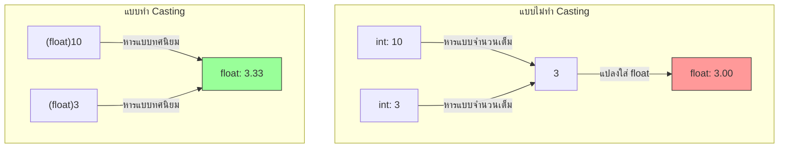

# Exercise 05: การหารเลขทศนิยมและการแปลงชนิดข้อมูล (Type Casting)

ในแบบฝึกหัดนี้ เราจะมาเรียนรู้เรื่องกลไกการคำนวณของคอมพิวเตอร์เกี่ยวกับการหาร และวิธีการบังคับให้คอมพิวเตอร์คืนค่าทศนิยมที่ถูกต้องด้วยวิธี **"Type Casting"**

---

## 💡 แนวคิดเข้าใจง่าย (Analogy)

สมมติคุณมี **เค้กกลมๆ 10 ก้อน (Integer: 10)** ต้องการแบ่งให้ **เพื่อน 3 คน (Integer: 3)** เท่าๆ กัน
ตามลอจิกคณิตศาสตร์ ทุกคนควรจะได้เค้กคนละ **3.33 ก้อน** 

แต่ในระบบของคอมพิวเตอร์:
* **วิธีที่ 1 (ไม่แปลงชนิด):** 
  ถ้าคุณสั่งให้ตัวเลขจำนวนเต็มหารกัน (`10 / 3`) แล้วเก็บผลลัพธ์ลงในถ้วยเก็บทศนิยม (`float`)
  คอมพิวเตอร์จะแอบแบ่งเค้กแบบจำนวนเต็มก่อน คือได้คนละ **3 ก้อน** (เศษเค้กที่เหลือตัดทิ้งทันที) แล้วจึงนำเลข 3 นี้ไปเทใส่ถ้วยทศนิยม ทำให้ผลที่ได้กลายเป็น **3.00** (เสียเศษทศนิยมไปเปล่าประโยชน์)

* **วิธีที่ 2 (แปลงชนิดชั่วคราว - Type Casting):** 
  เหมือนกับการนำป้ายสติกเกอร์คำว่า **"ทศนิยม (float)"** ไปแปะทับกล่องเค้กและจำนวนคนชั่วคราวก่อนเริ่มหาร `(float)10 / (float)3`
  คอมพิวเตอร์จะรู้ทันทีว่าการหารครั้งนี้ต้องเก็บจุดทศนิยมไว้ด้วย ผลลัพธ์ที่ได้จึงออกมาเป็น **3.33** อย่างเที่ยงตรง!

---

## 📊 ตารางเปรียบเทียบการคำนวณ

---

## 🔍 อธิบายโค้ดที่สำคัญ

* **`float result1 = numA / numB;`**
  เป็นการหารจำนวนเต็มสองตัว ซึ่งภาษา C++ จะคัดเศษทศนิยมออกก่อนเหลือแค่ `3` จากนั้นจึงนำไปกำหนดค่าให้ตัวแปรประเภท float จึงได้ผลลัพธ์เป็น `3.00`
* **`float result2 = (float)numA / (float)numB;`**
  การเขียน `(float)` ด้านหน้าตัวแปร เรียกว่า **Type Casting** เป็นการแปลงชนิดข้อมูลชั่วคราวเฉพาะตอนคำนวณแถวนั้น เพื่อบังคับให้คอมพิวเตอร์ทำการหารแบบจุดทศนิยม ผลลัพธ์จึงได้ค่าทศนิยมจริงคือ `3.33`

---

## 🚀 วิธีการทดสอบ

1. เปิดไฟล์ [exercise05.ino](file:///g:/My%20Drive/0.Working.2026/SSC20.%E0%B8%AA%E0%B8%AD%E0%B8%99%E0%B8%87%E0%B8%B2%E0%B8%99%E0%B8%9E%E0%B8%B1%E0%B8%92%E0%B8%99%E0%B8%B2Android/Lab_Embedded_System/Day1_C_Arduino_Lab/exercise05/exercise05.ino) ในโปรแกรม **Arduino IDE**
2. อัปโหลดโค้ดลงบอร์ด
3. เปิดหน้าต่าง **Serial Monitor** เพื่อเปรียบเทียบความแตกต่างระหว่างผลลัพธ์ที่ได้จากทั้งสองวิธี
4. สังเกตว่าผลลัพธ์แบบที่ 2 (Cast แล้ว) จะแสดงค่าจุดทศนิยม `.33` ที่ถูกต้องออกมา!
