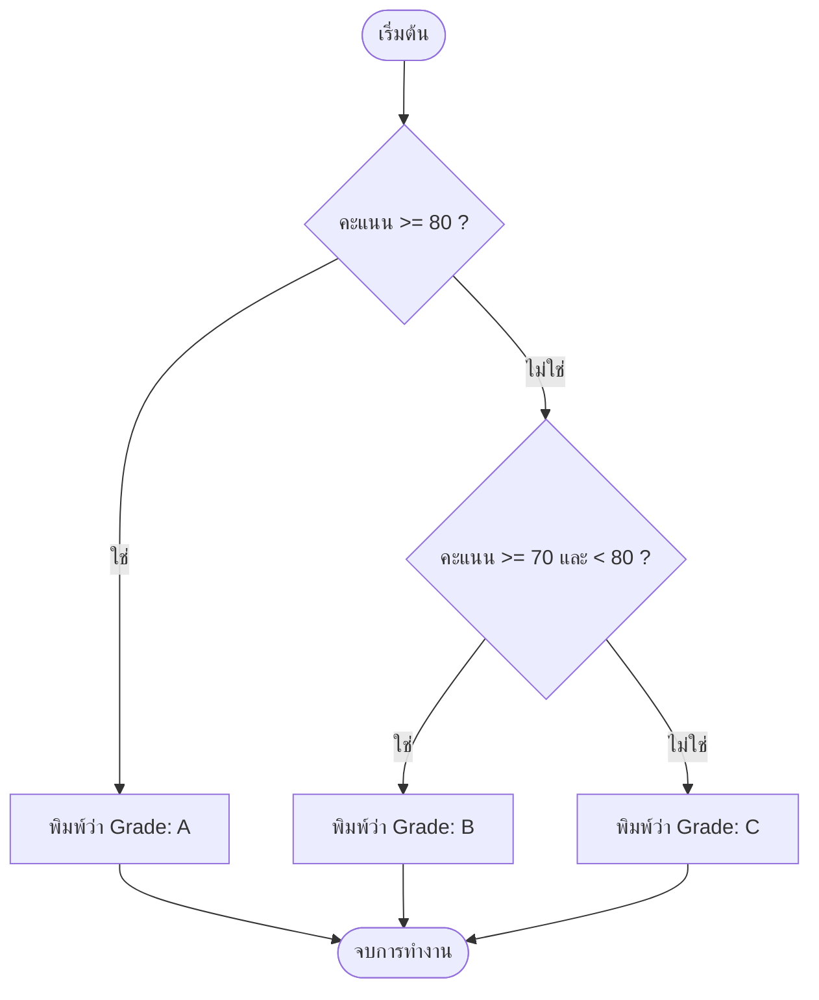

# Exercise 07: ระบบคัดแยกเกรดและโครงสร้างเงื่อนไข (`if-else` & `&&`)

ในแบบฝึกหัดนี้ เราจะก้าวเข้าสู่หัวใจของการควบคุมโปรแกรม นั่นคือการใช้เงื่อนไข **`if` (ถ้า)**, **`else if` (หรือถ้า)** และ **`else` (นอกเหนือจากนั้น)** เพื่อตัดสินใจเลือกเส้นทางการทำงานของบอร์ด

---

## 💡 แนวคิดเข้าใจง่าย (Analogy)

ให้จินตนาการถึง **"รางคัดแยกสินค้าในโรงงาน"**
มีกล่องสินค้าวิ่งมาตามสายพาน และแต่ละกล่องจะมีน้ำหนักกำกับอยู่ (เปรียบเหมือนตัวแปรคะแนน `score = 75`):

1. **ด่านประตูแรก (`if score >= 80`) :**
   * ถ้ากล่องหนัก 80 กิโลกรัมขึ้นไป ประตู 1 จะเปิดออกเพื่อดักกล่องนี้ไปใส่ตู้ **"Grade: A"** 
2. **ด่านประตูสอง (`else if score >= 70 && score < 80`) :**
   * หากกล่องหนักไม่ถึง 80 แต่มีน้ำหนักตั้งแต่ 70 กิโลกรัมขึ้นไป **และ** ต้องน้อยกว่า 80 กิโลกรัมด้วย (`&&` หมายถึง AND/และ) ประตู 2 จะเปิดดักกล่องนี้ไปใส่ตู้ **"Grade: B"**
3. **ด่านสุดท้าย (`else`) :**
   * กล่องอื่นๆ ที่เหลือทั้งหมดซึ่งไม่เข้าข่ายประตูข้างบนเลย จะถูกปล่อยให้ไหลตรงไปลงตู้สุดท้ายคือ **"Grade: C"**

---

## 📊 ผังการตัดสินใจ (Decision Flowchart)

---

## 🔍 อธิบายโค้ดที่สำคัญ

* **`if (เงื่อนไข)`**
  หากเงื่อนไขในวงเล็บเป็นจริง (`true`) โปรแกรมจะเข้าไปรันโค้ดในปีกกา `{ }` ทันที
* **`else if (เงื่อนไขใหม่)`**
  ใช้สำหรับดักเช็คเงื่อนไขอื่นเพิ่มเติมต่อจากตัวแรก
* **`&&` (ตัวดำเนินการเปรียบเทียบตรรกะแบบ "และ")**
  เงื่อนไขทั้งหมดซ้ายและขวาจะต้องเป็นจริงพร้อมกัน ผลลัพธ์จึงจะเป็นจริง (เช่น คะแนนต้องไม่ต่ำกว่า 70 และในขณะเดียวกันก็ต้องต่ำกว่า 80 ด้วย)

---

## 🚀 วิธีการทดสอบ

1. เปิดไฟล์ [exercise07.ino](file:///g:/My%20Drive/0.Working.2026/SSC20.%E0%B8%AA%E0%B8%AD%E0%B8%99%E0%B8%87%E0%B8%B2%E0%B8%99%E0%B8%9E%E0%B8%B1%E0%B8%92%E0%B8%99%E0%B8%B2Android/Lab_Embedded_System/Day1_C_Arduino_Lab/exercise07/exercise07.ino) ในโปรแกรม **Arduino IDE**
2. ทำการอัปโหลดโค้ดลงบอร์ด
3. เปิดหน้าต่าง **Serial Monitor** เพื่อเช็คเกรดที่คำนวณได้
4. ทดลองแก้ค่าคะแนน `score = 75;` ในโค้ดบรรทัดที่ 3 เป็นเลขอื่นๆ เช่น `90`, `65` หรือ `70` จากนั้นกดอัปโหลดใหม่เพื่อดูผลลัพธ์การคัดกรองที่เปลี่ยนแปลงไป!
