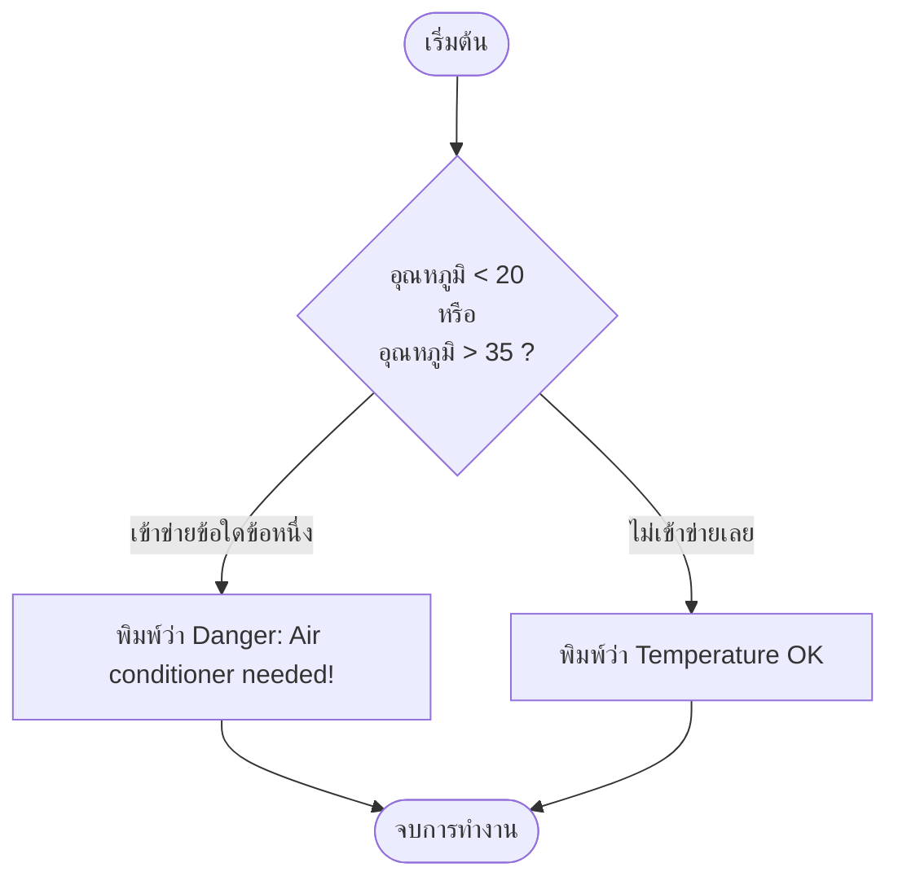

# Exercise 08: ระบบแจ้งเตือนอุณหภูมิอันตราย (`if-else` & `||`)

แบบฝึกหัดนี้จะแสดงการควบคุมเงื่อนไขโดยใช้ตัวดำเนินการตรรกศาสตร์ **OR (หรือ)** ซึ่งเขียนแทนด้วยเครื่องหมายขีดสองเส้น `||` เพื่อตรวจสอบเงื่อนไขที่ยืดหยุ่นขึ้น

---

## 💡 แนวคิดเข้าใจง่าย (Analogy)

ลองจินตนาการว่าคุณเป็น **"ระบบควบคุมบ้านอัจฉริยะ"**
มีหน้าที่ตรวจสอบความเหมาะสมของอุณหภูมิในห้องเก็บของเซิร์ฟเวอร์ โดยระบบจะส่งสัญญาณเตือนภัยอันตราย (`Danger: Air conditioner needed!`) ในกรณีใดกรณีหนึ่งดังต่อไปนี้:

* **กรณีที่ 1:** อุณหภูมิหนาวเกินไปจนชื้นเกาะบอร์ด (`temp < 20`)
* **หรือ (OR / `||`)**
* **กรณีที่ 2:** อุณหภูมิร้อนเกินไปจนชิปอาจละลายได้ (`temp > 35`)

หากค่าอุณหภูมิที่วัดได้ตกไปอยู่ใน **สภาวะใดสภาวะหนึ่งข้างต้น** (เช่น อุณหภูมิ 38 องศา ซึ่งมากกว่า 35) ระบบเตือนภัยจะดังขึ้นทันที! แต่ถ้าอุณหภูมิอยู่ในสภาวะปกติ เช่น 25 องศา (ไม่น้อยกว่า 20 และไม่มากกว่า 35) ระบบก็จะแจ้งว่าปกติดี (`Temperature OK`)

---

## 📊 ผังการวิเคราะห์อุณหภูมิ (Temperature Flowchart)

---

## 🔍 อธิบายโค้ดที่สำคัญ

* **`||` (ตัวดำเนินการตรรกะแบบ "หรือ" - OR)**
  ใช้สำหรับเชื่อมเงื่อนไขตั้งแต่สองตัวขึ้นไป ขอเพียงแค่มีเงื่อนไขตัวใดตัวหนึ่งในชุดนั้นเป็นจริง (`true`) ผลลัพธ์รวมก็จะเป็นจริงทันที
  *(ปุ่มกดพิมพ์เครื่องหมาย `|` บนคีย์บอร์ดมักอยู่เหนือปุ่ม Enter โดยต้องกด Shift ร่วมด้วย)*

---

## 🚀 วิธีการทดสอบ

1. เปิดไฟล์ [exercise08.ino](file:///g:/My%20Drive/0.Working.2026/SSC20.%E0%B8%AA%E0%B8%AD%E0%B8%99%E0%B8%87%E0%B8%B2%E0%B8%99%E0%B8%9E%E0%B8%B1%E0%B8%92%E0%B8%99%E0%B8%B2Android/Lab_Embedded_System/Day1_C_Arduino_Lab/exercise08/exercise08.ino) ในโปรแกรม **Arduino IDE**
2. อัปโหลดโค้ดลงบอร์ด
3. เปิดหน้าต่าง **Serial Monitor**
4. ทดลองปรับเปลี่ยนตัวเลข `temp = 38;` ในโค้ดบรรทัดที่ 3 เป็นอุณหภูมิแบบอื่นๆ เช่น:
   * แก้เป็น `18` (ต่ำกว่า 20) ➔ ผลลัพธ์ต้องขึ้นแจ้งเตือนอันตราย
   * แก้เป็น `28` (อยู่ระหว่าง 20-35) ➔ ผลลัพธ์ต้องแสดงปกติ
   * แก้เป็น `40` (มากกว่า 35) ➔ ผลลัพธ์ต้องขึ้นแจ้งเตือนอันตราย
5. กดอัปโหลดโค้ดใหม่ทุกครั้งที่แก้ไขเสร็จเพื่อทดสอบผล!
