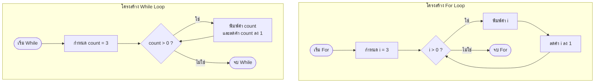

# Exercise 10: การวนซ้ำและนับถอยหลัง (`for` & `while` loop)

แบบฝึกหัดนี้จะพาทุกคนไปเรียนรู้กลไกที่ทำให้คอมพิวเตอร์ทำงานซ้ำๆ ได้อย่างรวดเร็วด้วยคำสั่ง **`for` loop** และ **`while` loop** โดยจำลองการเขียนคำสั่งนับถอยหลังปล่อยจรวด (3, 2, 1, Go!)

---

## 💡 แนวคิดเข้าใจง่าย (Analogy)

การทำลูปเปรียบเสมือน **"การสั่งให้นักวิ่งวิ่งรอบสนามแข่งขัน"**:

1. **การใช้ `for` loop (รู้จำนวนรอบล่วงหน้าชัดเจน) :**
   * เหมือนผู้ควบคุมบอกว่า: **"จงวิ่งทั้งหมด 3 รอบนะ"**
   * ในโค้ดจะมีระบุครบจบในแถวเดียว:
     * จุดสตาร์ทเริ่มที่รอบไหน? (`int i = 3;`)
     * ตรวจสอบว่าวิ่งครบเงื่อนไขหรือยัง? (`i > 0;`)
     * วิ่งจบแต่ละรอบให้ลด/เพิ่มทีละเท่าไหร่? (`i--`)

2. **การใช้ `while` loop (เน้นทำไปเรื่อยๆ จนกว่าเงื่อนไขจะเปลี่ยน) :**
   * เหมือนผู้ควบคุมบอกว่า: **"ตราบใดที่คุณยังมีพลังงานเหลือมากกว่าศูนย์ ให้วิ่งต่อไปเรื่อยๆ นะ"**
   * ในโค้ดจะแยกส่วนประกอบกัน:
     * กำหนดพลังงานเริ่มต้นนอกลูป (`int count = 3;`)
     * ตรวจเงื่อนไขที่ปากทางเข้าลูป (`while (count > 0)`)
     * ผู้เขียนโค้ดต้องอย่าลืมเขียนโค้ดลดพลังงานลงเองข้างในลูป (`count--;`) ไม่เช่นนั้นนักวิ่งจะหมดแรงและวิ่งตลอดไปไม่มีวันสิ้นสุด (เกิดสภาวะ Infinite Loop / ลูปอนันต์ บอร์ดจะค้าง)

---

## 📊 ผังการทำงานเปรียบเทียบการทำซ้ำ (Loop Process)

---

## 🔍 อธิบายโค้ดที่สำคัญ

* **`for (int i = 3; i > 0; i--)`**
  สร้างตัวแปรโลคอล `i` ขึ้นมา มีค่าเริ่มที่ 3 วนลูปทำงานตราบเท่าที่ `i` มากกว่า 0 และลดค่าลงทีละ 1 ทุกครั้งที่ทำเสร็จในแต่ละรอบ
* **`while (count > 0) { ... count--; }`**
  ตรวจสอบเงื่อนไขที่ `count` หากมากกว่า 0 จะรันคำสั่งในปีกกา ซึ่งมีคำสั่ง `count--` เพื่อลดจำนวนรอบลงเรื่อยๆ ป้องกันลูปค้าง

---

## 🚀 วิธีการทดสอบ

1. เปิดไฟล์ [exercise10.ino](file:///g:/My%20Drive/0.Working.2026/SSC20.%E0%B8%AA%E0%B8%AD%E0%B8%99%E0%B8%87%E0%B8%B2%E0%B8%99%E0%B8%9E%E0%B8%B1%E0%B8%92%E0%B8%99%E0%B8%B2Android/Lab_Embedded_System/Day1_C_Arduino_Lab/exercise10/exercise10.ino) ในโปรแกรม **Arduino IDE**
2. อัปโหลดโค้ดลงบอร์ด
3. เปิดหน้าต่าง **Serial Monitor** เพื่อตรวจดูขั้นตอนการนับถอยหลังจากลูปทั้งสองรูปแบบ
4. ลองปรับตัวเลขค่าเริ่มต้นจาก `3` เป็นค่าที่ใหญ่ขึ้น เช่น `5` หรือ `10` เพื่อดูการนับถอยหลังที่มีจำนวนรอบมากขึ้น!
