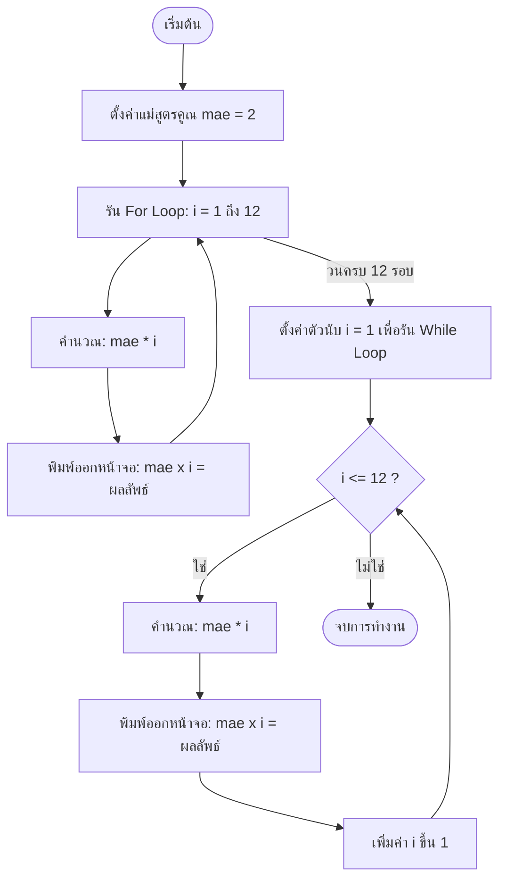

# Exercise 11: โปรแกรมสูตรคูณอัตโนมัติ (Loop Multiplier)

แบบฝึกหัดนี้จะเป็นการนำความรู้เรื่องลูป (`for` และ `while` loop) มาประยุกต์ใช้สร้างประโยชน์ โดยจัดทำเป็น **โปรแกรมพิมพ์ตารางแม่สูตรคูณอัตโนมัติ** ตามแม่ตัวเลขที่เราต้องการกำหนด

---

## 💡 แนวคิดเข้าใจง่าย (Analogy)

ให้ลองนึกภาพคุณเป็น **"ครูสอนเลขที่ต้องการเขียนสูตรคูณแม่ 2 ลงบนกระดานดำ"**
คุณมีสูตรตายตัวในใจคือ **"ตัวตั้งแม่สูตรคูณ (เช่น แม่ 2) คูณด้วยตัวคูณตั้งแต่ 1 ถึง 12"**
เพื่อบันทึกลงบนกระดานดำ 12 บรรทัด คุณต้องเขียนวนซ้ำดังนี้:

* เขียนบรรทัดที่ 1: `2 x 1 = 2`
* เขียนบรรทัดที่ 2: `2 x 2 = 4`
* ... ทำซ้ำขยับตัวคูณขึ้นทีละ 1 ขั้น
* เขียนบรรทัดสุดท้ายที่ 12: `2 x 12 = 24`

ในการเขียนโปรแกรม เราไม่จำเป็นต้องพิมพ์คำสั่ง `Serial.println` เองถึง 12 บรรทัด! เราเพียงแค่บอกให้คอมพิวเตอร์สร้างลูปที่เริ่มสตาร์ทตัวคูณที่ `1` ค่อยๆ วิ่งบวกเพิ่มทีละขั้นจนถึงเลข `12` แล้วสั่งให้คูณตัวเลขเก็บผลลัพธ์มาแสดงผลในบรรทัดเดียว คอมพิวเตอร์จะทำแทนเราทั้งหมดภายในเสี้ยววินาที

---

## 📊 ผังการทำงานวนคูณตัวเลข (Multiplication Process)

---

## 🔍 อธิบายโค้ดที่สำคัญ

* **`for (int i = 1; i <= 12; i++)`**
  วนลูปโดยเริ่มต้นดัชนีตัวคูณ `i` ที่ 1 และวนทำซ้ำไปเรื่อยๆ ตราบใดที่ `i` ยังคงน้อยกว่าหรือเท่ากับ 12 เมื่อทำเสร็จรอบแต่ละรอบ ค่า `i` จะถูกบวกเพิ่มขึ้นทีละ 1 (`i++`)
* **`mae * i`**
  ตัวอย่างการดำเนินการทางคณิตศาสตร์ นำตัวแปรแม่สูตรคูณหลักมาคูณกับดัชนีตัวนับในแต่ละรอบ

---

## 🚀 วิธีการทดสอบ

1. เปิดไฟล์ [exercise11.ino](file:///g:/My%20Drive/0.Working.2026/SSC20.%E0%B8%AA%E0%B8%AD%E0%B8%99%E0%B8%87%E0%B8%B2%E0%B8%99%E0%B8%9E%E0%B8%B1%E0%B8%92%E0%B8%99%E0%B8%B2Android/Lab_Embedded_System/Day1_C_Arduino_Lab/exercise11/exercise11.ino) ด้วยโปรแกรม **Arduino IDE**
2. อัปโหลดโค้ดลงบอร์ด
3. เปิดหน้าต่าง **Serial Monitor** เพื่อตรวจดูผลลัพธ์สูตรคูณที่พิมพ์ออกมาแยกกันจากทั้ง For Loop และ While Loop
4. ลองปรับแก้ค่าตัวแปร `mae` ในโค้ดบรรทัดที่ 3 จาก `2` เป็นแม่เลขอื่น เช่น `5`, `7` หรือ `12` แล้วอัปโหลดใหม่เพื่อสร้างตารางสูตรคูณชุดใหม่ในพริบตา!
