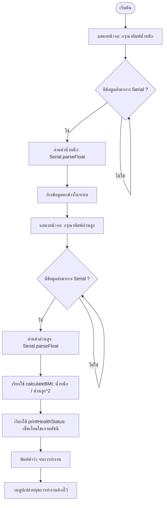

# Exercise 12: โปรแกรมคำนวณดัชนีมวลกายแบบโต้ตอบ (Interactive BMI Calculator)

แบบฝึกหัดนี้ยกระดับการเขียนโปรแกรมขึ้นไปอีกขั้น โดยผู้เขียนจะได้พัฒนา **โปรแกรมรับอินพุตโต้ตอบจริงจากผู้ใช้งานผ่านหน้าจอ (Interactive Program)** เพื่อคำนวณและประเมินค่าดัชนีมวลกาย (BMI) 

---

## 💡 แนวคิดเข้าใจง่าย (Analogy)

ให้ลองจินตนาการว่าโปรแกรมนี้คือ **"ตู้คีออสวัดสุขภาพอัตโนมัติ"** ที่ตั้งอยู่ในโรงพยาบาล:

1. **การยืนรออินพุต (`while (Serial.available() == 0)`) :**
   * เหมือนตู้คีออสเปิดหน้าจอค้างไว้และแสดงข้อความบอกให้คุณ **"กรุณาใส่ข้อมูลน้ำหนักของคุณ"** 
   * ตู้จะค้างและไม่ขยับไปไหนจนกว่าคุณจะกดพิมพ์ตัวเลขแล้วกดส่ง (กด Enter)
2. **การแยกหน้าที่ทำงาน (Functions) :**
   * **`calculateBMI` (ห้องคำนวณ)** : รับน้ำหนักและส่วนสูงเข้าไปหาค่าตามสูตรคณิตศาสตร์แล้วส่งตัวเลขผลลัพธ์กลับออกมา
   * **`printHealthStatus` (ห้องวิเคราะห์ผล)** : รับค่าดัชนีมวลกายมาเปรียบเทียบในประตูกรองเงื่อนไขเพื่อตัดสินใจพิมพ์ผลประเมินว่าคุณอ้วนไป ผอมไป หรืออยู่ในเกณฑ์ปกติ
3. **การกดหยุดการทำงานเมื่อจบงาน (`while (true)`) :**
   * บอร์ด Arduino จะทำงานในลูป `loop()` ซ้ำๆ ไปเรื่อยๆ ตลอดเวลา การเขียนลูปว่างเปล่าให้ค้างอยู่ตอนท้ายสุด เปรียบเหมือนตู้ทำหน้าที่บริการเสร็จแล้วแสดงหน้าจอ **"จบการทำงาน"** แล้วหยุดรอจนกว่าวิทยากรหรือผู้เรียนจะกดปุ่ม Reset เริ่มใหม่

---

## 📊 ผังการทำงานระบบตรวจวัดสุขภาพ (BMI Process Flow)

---

## 🔍 อธิบายโค้ดที่สำคัญ

* **`Serial.available()`**
  ใช้อ่านจำนวนอักขระหรือข้อมูลที่ผู้ใช้งานพิมพ์และส่งมาในบัฟเฟอร์การสื่อสาร (ถ้าเป็น 0 แปลว่ายังไม่มีใครพิมพ์ส่งมา)
* **`Serial.parseFloat()`**
  เป็นฟังก์ชันดึงค่าข้อมูลประเภทตัวเลขทศนิยมที่ส่งเข้ามาผ่านช่อง Serial ออกมาเก็บไว้ในตัวแปรทันที
* **`while(Serial.available() > 0) { Serial.read(); }`**
  ลูปพิเศษสั้นๆ สำหรับล้างข้อความขยะหรือค่าตกค้างในช่องสัญญาณออกไปให้หมด เพื่อป้องกันไม่ให้ไปรบกวนการรออ่านข้อมูลในด่านถัดไป

---

## 🚀 วิธีการทดสอบแบบพิมพ์โต้ตอบ

1. เปิดไฟล์ [exercise12.ino](file:///g:/My%20Drive/0.Working.2026/SSC20.%E0%B8%AA%E0%B8%AD%E0%B8%99%E0%B8%87%E0%B8%B2%E0%B8%99%E0%B8%9E%E0%B8%B1%E0%B8%92%E0%B8%99%E0%B8%B2Android/Lab_Embedded_System/Day1_C_Arduino_Lab/exercise12/exercise12.ino) ด้วยโปรแกรม **Arduino IDE**
2. อัปโหลดโค้ดลงบอร์ด
3. เปิดหน้าต่าง **Serial Monitor**
4. สังเกตแถบสำหรับพิมพ์ข้อความส่งข้อมูลที่อยู่บริเวณส่วนบนหรือล่างของหน้าต่าง Serial Monitor
5. **ขั้นตอนการตอบข้อถาม:**
   * หน้าจอจะแสดงคำถาม: `กรุณาพิมพ์ 'น้ำหนัก' (kg) แล้วกด Enter:`
   * ให้พิมพ์ตัวเลขน้ำหนักของคุณ (เช่น `65`) ลงในช่องส่งข้อความแล้ว **กดปุ่ม Send หรือกด Enter**
   * หน้าจอจะรับค่าและถามต่อ: `กรุณาพิมพ์ 'ส่วนสูง' (cm) แล้วกด Enter:`
   * พิมพ์ส่วนสูงหน่วยเซนติเมตรของคุณ (เช่น `170`) แล้ว **กด Enter**
6. โปรแกรมจะนำค่าทั้งสองไปคำนวณและแสดงค่า BMI พร้อมประเมินผลสุขภาพให้คุณทันที!
7. หากต้องการคำนวณใหม่อีกครั้ง ให้กดปุ่ม **RESET** บนบอร์ด Arduino
