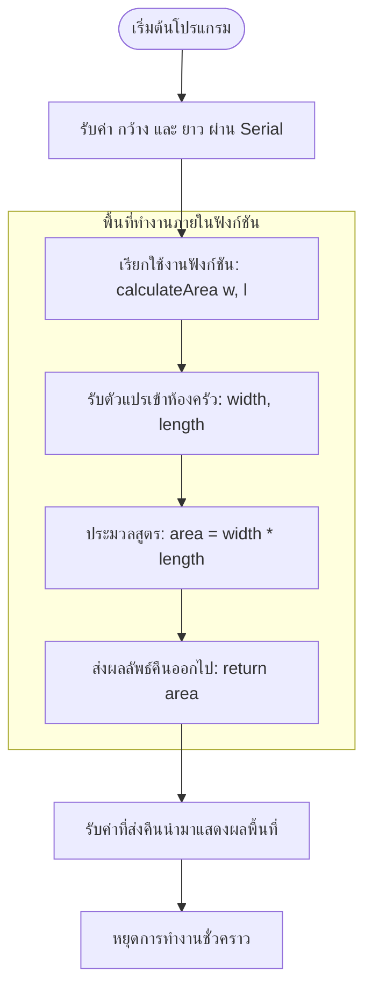

# Exercise 13: ฟังก์ชันและระบบคำนวณพื้นที่ (Functions & Parameters)

แบบฝึกหัดสุดท้ายของบทเรียนนี้ จะพาผู้เรียนไปสัมผัสกับโครงสร้างการสร้างฟังก์ชันใช้งานของตัวเองอย่างเป็นทางการ พร้อมระบบรับค่าคำนวณพื้นที่สี่เหลี่ยมแบบโต้ตอบผ่าน Serial Monitor

---

## 💡 แนวคิดเข้าใจง่าย (Analogy)

การเขียนและใช้งาน **"ฟังก์ชัน" (Function)** เปรียบเสมือน **"การสั่งอาหารในร้านอาหาร"**:

1. **วัตถุดิบนำเข้า (Parameters/Arguments) :**
   * เหมือนคุณส่ง **"ผักแป้ง" และ "เนื้อสัตว์"** (ส่งตัวแปรความกว้าง `width` และความยาว `length` ของห้อง) เข้าห้องครัว
2. **แม่ครัวรับหน้าที่ปรุงอาหาร (Function Processing) :**
   * แม่ครัวคือฟังก์ชันชื่อ **`calculateArea`** ภายในห้องครัวนี้จะมีขั้นตอนสูตรลับเฉพาะคือ: นำเอาวัตถุดิบกว้างกับยาวมาคูณกัน (`width * length`) แล้วจัดเตรียมใส่จานให้เรียบร้อย
3. **การเสิร์ฟเมนูอาหารออกไป (Return Value) :**
   * เมื่อแม่ครัวปรุงเสร็จ จะทำการส่งอาหารกลับคืนมาผ่านพนักงานเสิร์ฟด้วยคำสั่ง **`return`** เพื่อนำผลรวมพื้นที่สี่เหลี่ยมที่พร้อมทาน ไปแสดงผลวางโชว์ไว้บนโต๊ะอาหาร (แสดงผลบน Serial Monitor)

การแยกโค้ดแบบนี้ช่วยให้คุณสามารถคำนวณพื้นที่สี่เหลี่ยมได้บ่อยตามต้องการโดยเรียกแค่ชื่อแม่ครัว `calculateArea(กว้าง, ยาว)` ไม่ต้องมาเขียนโค้ดสูตรคูณเดิมๆ ซ้ำแล้วซ้ำอีกให้เหนื่อยและรกตา!

---

## 📊 ผังการไหลข้อมูลฟังก์ชัน (Function Logic Flow)

---

## 🔍 อธิบายโค้ดที่สำคัญ

* **`long calculateArea(int width, int length) { ... }`**
  * **`long`** : คือประเภทข้อมูลของผลลัพธ์ที่จะถูกส่งคืนออกมาหลังจากคำนวณเสร็จ (คืนค่าเป็นตัวเลขขนาดใหญ่)
  * **`calculateArea`** : คือชื่อของฟังก์ชัน (ชื่อแม่ครัว)
  * **`int width, int length`** : พารามิเตอร์หรือข้อมูลดิบที่จะต้องโยนเข้ามาให้ฟังก์ชันใช้ตอนเรียกใช้งาน
* **`return area;`**
  คำสั่งสั่งให้ฟังก์ชันหยุดและทำการส่งข้อมูลในตัวแปร `area` ออกไปภายนอกฝั่งคนเรียกใช้งาน

---

## 🚀 วิธีการทดสอบ

1. เปิดไฟล์ [exercise13.ino](file:///g:/My%20Drive/0.Working.2026/SSC20.%E0%B8%AA%E0%B8%AD%E0%B8%99%E0%B8%87%E0%B8%B2%E0%B8%99%E0%B8%9E%E0%B8%B1%E0%B8%92%E0%B8%99%E0%B8%B2Android/Lab_Embedded_System/Day1_C_Arduino_Lab/exercise13/exercise13.ino) ด้วยโปรแกรม **Arduino IDE**
2. อัปโหลดโค้ดลงบอร์ด
3. เปิดหน้าต่าง **Serial Monitor**
4. ตอบคำถามที่หน้าต่าง Serial Monitor:
   * ป้อนตัวเลขความกว้าง (เช่น `15`) แล้วกด **Enter**
   * ป้อนตัวเลขความยาว (เช่น `30`) แล้วกด **Enter**
5. โปรแกรมจะส่งค่าเข้าฟังก์ชัน `calculateArea` เพื่อประเมินผลคูณ และสรุปผลลัพธ์พื้นที่เป็นตารางหน่วยให้คุณทันที!
6. กดปุ่ม **RESET** บนบอร์ดเพื่อเริ่มทำการคำนวณพื้นที่รูปทรงใหม่
